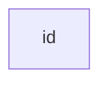

# Push-Swap

Push-swap is a project that delves into the realm of algorithms and complexity. The purpose is to devise a sorting algorithm for arranging a variable count of values, encompassing both positive and negative integers. Within the push_swap framework, this objective is accomplished by transferring values between two stacks, employing a restricted set of operations.

